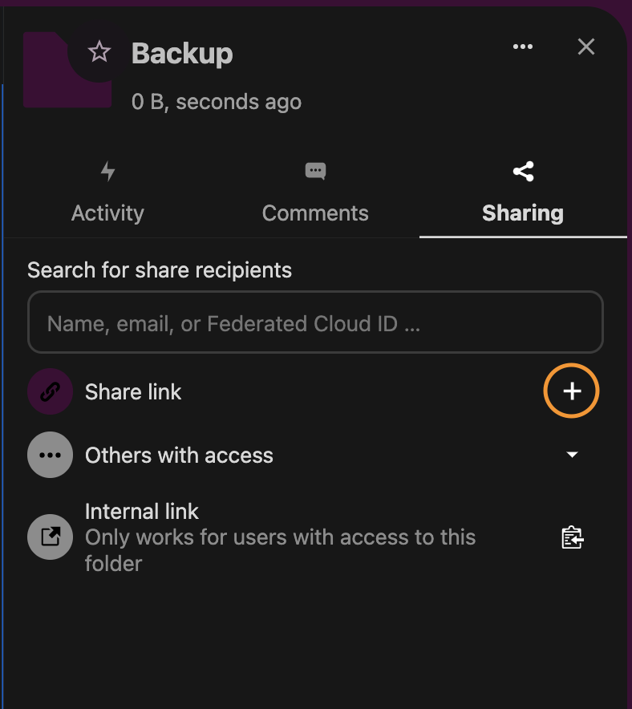
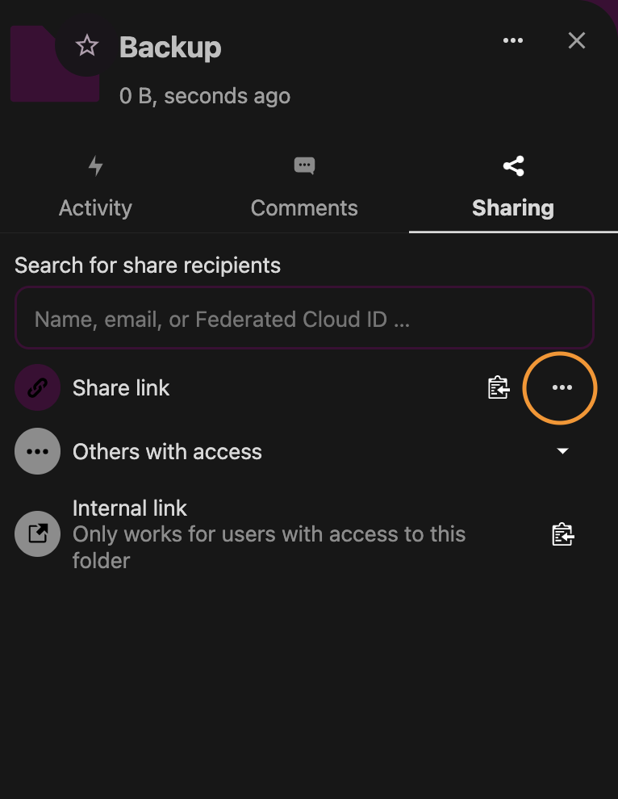
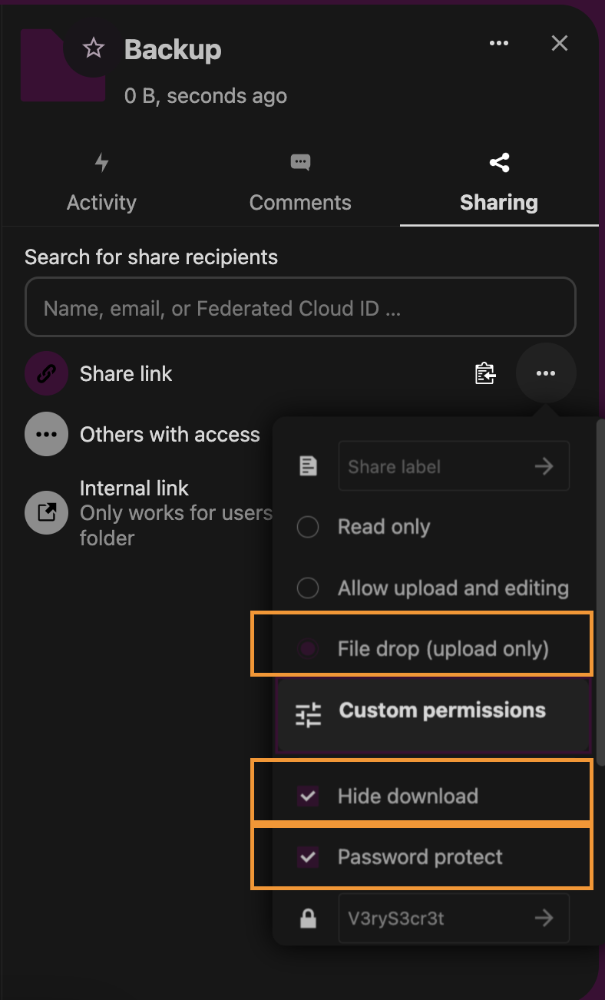
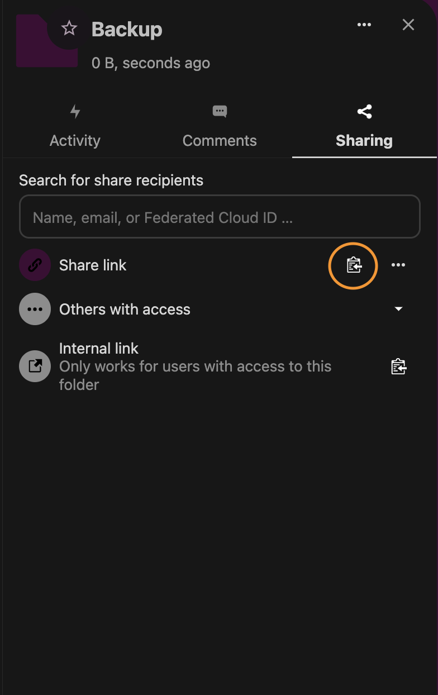

# Push ➡️ 2 ➡️ Nextcloud

_by the [#sathoshiengineeringcrew](https://satoshiengineering.com/)_

[](LICENSE)

Simple docker based backup solution for nextcloud users. It is a file change monitor that uploads the file on file change to a nextcloud share.

Source can be found on [Github](https://github.com/Satoshi-Engineering/Push2Nextcloud).

Uses cases:
* Redis Database dump
* LND Static Channel Backup

There currently two upload modes for nextcloud:

- NewFile: On File Change the date&time is appended and the file uploaded e.g. `2022-03-30_130059-dump.data`
- Overwrite: The file is uploaded and overwritten e.g. `dump.data`

## Usage

Sadly it's not one of these out of the box projects. There are some steps that need to be done.

1. Create Nextcloud Share
2. Set Environment Variables
3. Run with docker-compose

### Create Nextcloud Share

1. Open Share view of the folder you want to use as drop off and click the `+` Symbol to create a share link.
   


2. Open the details `...`



3. Choose:
   - For `NEXTCLOUD_UPLOAD_MODE=newfile` choose `File Drop` which means even if someone else discovers the url, the files can not be seen.
   - For `NEXTCLOUD_UPLOAD_MODE=overwrite` choose `Allow upload and editing`
   - Also check "Hide download" and 
   - check "Password protect" and choose a good password, this will be your `NEXTCLOUD_PWD`



4. Copy the Share link which looks like that:

`https://nextcloud.yourcompany.com/s/t321tytR5NJunoD`

The last part is the ShareId or the "user" that we need for the tool `https://nextcloud.yourcompany.com/s/<NEXTCLOUD_USR>`




### Set Environment Variables

Let's assume the watched file or directory will be at `../data/`

- Mount the directory of the watched file/directory into the container e.g.  `../data:/backup:ro`
- Set the either a watched file **or** directory
  - set `SOURCE_FILE` to `/backup/dump.data`
  - or `SOURCE_DIRECTORY` to `/backup/directory-with-data`
- Set `NEXTCLOUD_USR` to the last part of you share link: `https://nextcloud.yourcompany.com/s/<NEXTCLOUD_USR>`
- Set `NEXTCLOUD_PWD` to the password set in Nextcloud
- Set `NEXTCLOUD_URL` to your instance like `https://<YOUR NEXTCLOUD INSTANCE>/public.php/webdav/`

### Run with docker-compose

[Copy](docker-compose.yml) or create the docker-compose.yml

```yaml
version: "3.9"
  
services:
  push2next:
    image: "satoshiengineering/push2nextcloud:latest"
    container_name: "push2nextcloud"
    restart: unless-stopped
    volumes:
      - ../data:/backup:ro
      
    environment:
      - SOURCE_FILE=/backup/dump.data
      - DEST_FILE=dump.data

      - NEXTCLOUD_USR=jack
      - NEXTCLOUD_PWD=secret
      - NEXTCLOUD_URL=https://<YOUR NEXTCLOUD INSTANCE>/public.php/webdav/
```

Run the docker-compose file:
```shell
docker-compose up -d
```

If you wanna check the logs
```shell
docker logs -n 200 -f push2nextcloud
```

## Configuration 

Description can also be found in here [.env.example](.env.example) file.

### NEXTCLOUD_UPLOAD_MODE's

* `newfile`
```
NEXTCLOUD_UPLOAD_MODE=newfile
```

If not set or not recognized it will be mode "newfile" which means:

The filename on nextcloud will be generated with date & time like this `YYYY-MM-DD_HHMMSS-<DEST_FILE>`.

Example: `DEST_FILE=dump.data` generates `2022-03-30_130059-dump.data`.

* `overwrite`

```
NEXTCLOUD_UPLOAD_MODE=overwrite
```

The filename on nextcloud will be `DEST_FILE`

Example: `DEST_FILE=dump.data` generates `dump.data`.

### DEST_FILE_TAR
```
DEST_FILE_TAR=true
```
Compresses the source file. This will add .tar.gz to the destination file.

Example: `DEST_FILE=dump.data` generates `2022-03-30_130059-dump.data.tar.gz`.


### Restarting policy of docker containers

The restarting policy is set to `unless-stopped`, which means is restarting the container on `exit != 0`, `exit == 0` and startup of the docker service.

If you wanna go more indepth: [restart @ docker-compose](https://docs.docker.com/compose/compose-file/compose-file-v3/#restart)

FYI:
- The `restart` option is ignored when deploying a stack in swarm mode.
- `restart_policy` is available in compose v3 and replaces `restart` compose v2.*

## Notes

* When you start the docker container, initially one backup is done.

### Trigger the Backup manually

```shell
# either
touch path/to/file.dump

# or
docker exec -it <container_name> /scripts/upload.sh
```

If started with docker-compose file of this repository
```shell
docker exec -it push2nextcloud /scripts/upload.sh
```

### Run with Docker and .env file
```shell
docker run -d -v ./data:/backup:ro --env-file .env --name push2nextcloud satoshiengineering/push2nextcloud:latest
```

# Hints
- It should also work with a nextcloud user and password, but I think the link is different (because somehow the path must be somewhere)

- Overwriting is only with write permissions https://help.nextcloud.com/t/curl-upload-no-overwrite-possible/69970
- Infos to Storage Quota & Versioned Files: https://docs.nextcloud.com/server/latest/user_manual/ar/files/quota.html
> When version control is enabled, the older file versions are not counted against quotas.
>
> If you create a public share via URL and allow uploads, any uploaded files count against your quota
>
> Deleted files that are still in the trash bin do not count against quotas. The trash bin is set at 50% of quota. Deleted file aging is set at 30 days. When deleted files exceed 50% of quota then the oldest files are removed until the total is below 50%.

# Tip us

If you like this project, why not [send some tip love?](https://lnbits.thespielplatz.com/tipjar/2)